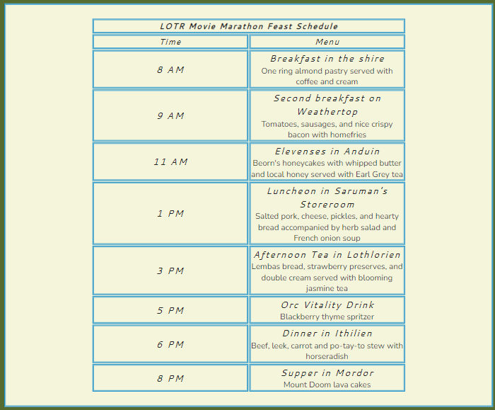

# The Fantasy Fanatics

The Fantasy Fanatics is a site that keeps fans of the fantasy genre up to date on all the latest news and information on the universes they love. The site includes articles on history and lore, food, fashion, quizzes, polls and all the hottest gossip. With content covering Harry Potter, Lord of the Rings, Star Wars, Doctor Who and more, it appeals to a wide range of fantasy topics. The site is useful for fans to read engaging articles, povide delicious recipes, and contribute a fun, social community for the fantasy-lover in everyone. 

## Features

### Existing Features
1 Navigation Bar 
- Fully responsive, links to the Home Page, Featured Articles and Contact sections of the website. 
- Fixed header allows the user to easily jump between sections.

2 Landing / Hero Image
- The main image is of a fantasy scene to grab the users attention and convey a general sense of awe. 

3 Featured Article
- The first content the reader encounters is a humorous article comparing the styles of two wizards. 
- The entertainment value will draw the user further down the page to explore additional featured content. 

4 Quiz
- This section is an interactive quiz where users can vote on various fantasy themed questions and opinions. 
- The quiz gives users a voice in the fandom they love, media they like and upcoming releases they are excited for.
- This section will be updated as the featured content is updated, as well as with new releases in fantasy universes.

5 Recipe
- The recipe section features a movie marathon feast to follow along with, giving menu items and times to serve. (Original Trilogy only, sorry Hobbit fans).
- This is a fun and interesting idea to supplement a popular movie trilogy to watch. The foods call to the types of food from the films, providing a sense of connection.

6 Upcoming content
- This section gives a brief introduction to upcoming featured content. 
- As the user makes their way down the page, this is meant to pique the users interest to return for the latest content.

7 Contact / Social Media
- The footer includes a contact email and links to various social media pages where additional content and communities are hosted. 
- It encourages the user to connect via other outlets, depending on their content preference and type.

### Features Left to Implement
- A 'See Results' feature for the Quizzes, as well as a proper location for the 'action' in the form.
- An online store to purchase fantasy-themed products.
- A photo carousel in Bootstrap for the featured article. 

## Testing
- This project was built in Google Chrome, mostly in GitPod but also some from previous work in CodePen (cited below). It was tested in Microsoft Edge, Firefox and Safari browsers and on mobile phones, laptops and desktop monitors. 
- The fixed header and NAV elements all work as intended, jumping to the correct section of the webpge.
- The quiz interactions all work (10/10 for Star Wars *is* the correct answer) Although at the time of this publishing there is not a functional back-end destination for the 'action' attribute to send the quiz results to or 'fetch' other results from. 
- The links to social media open in a new tab to the correct web address. 
- One consideration I did not anticipate was viewing on ultra-wide PC monitors. 
- Also, when running Lighthouse, the SEO comes back limited due to links not being crawlable. But the links are from the font-awesome script and in JavaScript, which is outside of the current scope of this project.
- Accessibility needed to be improved on the 'Submit' button on the quiz. This was solved by increasing the font-weight from 'bold' to 800.

### HTML Errors returned during validator testing: 
- Line 40 / Removed alt description in the 'div' for the Hero Image.
- Lines 76/81/95/105 Replaced 'section' with 'div'
- Lines 126/129/130 Removed H2/H3 and replaced with 'th'

### CSS Errors returned during validator testing: 
- Line 151 Incorrect value for margin, that specific value was not needed so it was removed. 

### Validator Testing
1 HTML
- No errors were returned when passing through the official [W3C validator](https://validator.w3.org/nu/?doc=https%3A%2F%2Fchristianlund2.github.io%2Ffantasy-fanatics%2F).

2 CSS
- No errors were returned when passing through the official [(Jigsaw) validator](https://jigsaw.w3.org/css-validator/validator?uri=https%3A%2F%2Fchristianlund2.github.io%2Ffantasy-fanatics%2F&profile=css3svg&usermedium=all&warning=1&vextwarning=&lang=en).

### Unfixed Bugs
- No unfixed bugs remain.

## Deployment
1 This site was deployed to GitHub pages. 
- In the "fantasy-fanatics" repository, click on the "Settings" tab.
- Under "Code and Automation", select the "Pages" section.
- Under Source, change from "Branch: None" to "Branch: Main" and click "Save".
- After a few minutes, a banner appears confirming the site is published with a live link. 

- Live link can be found here: https://christianlund2.github.io/fantasy-fanatics/

## Credits
### Content
The entirety of the "Featured Article", "Quiz" and "Recipe" sections were sourced from my own previous material, hosted at: https://codepen.io/TheHungryStork/pen/QWdXbvq

self.credit.pic

General styling for the following sections of code were sourced from the "Love Running" project:
- Header : https://learn.codeinstitute.net/courses/course-v1:CodeInstitute+LR101+2021_T1/courseware/4a07c57382724cfda5834497317f24d5/637be1a2e3b84b25aa33f3ab4d98603c/
- Navigation Bar :  https://learn.codeinstitute.net/courses/course-v1:CodeInstitute+LR101+2021_T1/courseware/4a07c57382724cfda5834497317f24d5/637be1a2e3b84b25aa33f3ab4d98603c/
- Hero Image and Text Overlay : https://learn.codeinstitute.net/courses/course-v1:CodeInstitute+LR101+2021_T1/courseware/4a07c57382724cfda5834497317f24d5/6fd29d155c3b42248ff57bae32978a4b/
- Social Media Link Layout : https://learn.codeinstitute.net/courses/course-v1:CodeInstitute+LR101+2021_T1/courseware/4a07c57382724cfda5834497317f24d5/e6d4cda2bc08458ba94d2092be9bad3a/
- Media Queries : https://learn.codeinstitute.net/courses/course-v1:CodeInstitute+LR101+2021_T1/courseware/4a07c57382724cfda5834497317f24d5/d48e6af85eb84191bebd57ece8b6fb73/

Creating a fixed header using z-index : https://stackoverflow.com/questions/16315125/position-absolute-has-greater-z-index-than-position-fixed

Inverting the colors for Social Media Pseudo Hover Class : https://stackoverflow.com/questions/17741629/how-can-i-invert-color-using-css

### Media
- Hero Image sourced from : https://pixabay.com/illustrations/buckled-book-book-fantasy-photoshop-2180047/
